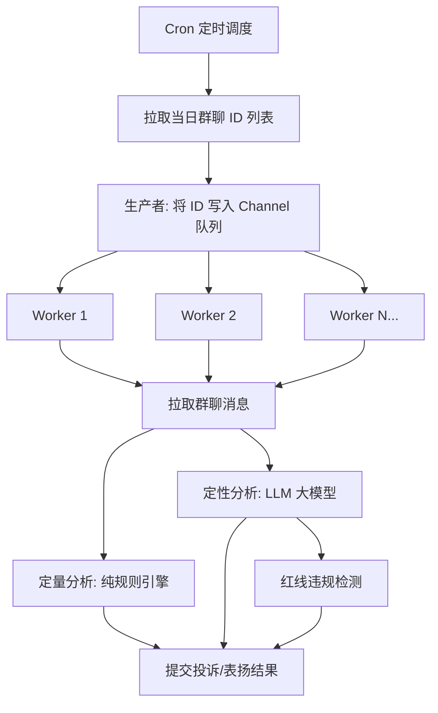

# Group Audit · 群聊质检审核服务

基于 Go 原生 Worker Pool 模式构建的群聊服务质量自动化审核系统。每天定时拉取群聊记录，通过**规则引擎 + AI 大模型**双通道分析，自动生成表扬、经验、警告三类审核结论，并支持服务红线违规检测。

## 架构概览



| 模块 | 职责 |
|------|------|
| `scheduler` | 定时 Producer，调用后端接口获取群聊 ID，注入 Channel |
| `worker` | 固定数量 Goroutine 的 Consumer Pool，从 Channel 抢占任务 |
| `audit/quantitative` | 纯规则引擎：零消息检测、响应超时检测 |
| `audit/qualitative` | LLM 调用：问题解决判定、表扬识别、红线违规排查 |
| `ai` | 大模型 Provider 接口，当前实现 DeepSeek，兼容 Ollama/Qwen 等 |
| `client` | 后端 API 调用封装（群聊列表、消息记录、投诉提交） |
| `mock` | 本地测试实现，7 个预设场景覆盖全流程，零网络依赖 |

## 目录结构

```
group-audit/
├── main.go                     # 入口：组装依赖、启动调度、优雅退出
├── config.example.yaml         # 配置模板（复制为 config.yaml 后使用）
├── redline.md                  # 服务红线文档（可独立更新）
├── go.mod
├── internal/
│   ├── ai/
│   │   ├── provider.go         # Provider 接口
│   │   └── deepseek.go         # DeepSeek 实现（内置指数退避重试）
│   ├── audit/
│   │   ├── quantitative.go     # 定量分析：消息数 + 响应超时
│   │   └── qualitative.go      # 定性分析：LLM 判定 + 红线检测
│   ├── client/
│   │   ├── interfaces.go       # GroupFetcher / ComplaintSubmitter 接口
│   │   ├── group.go            # 群聊 API 客户端
│   │   └── complaint.go        # 投诉/表扬 API 客户端
│   ├── config/
│   │   ├── config.go           # 配置结构体定义
│   │   └── load.go             # YAML 加载 + 红线文档读取
│   ├── mock/
│   │   └── mock.go             # Mock 群聊数据（7 场景）+ Mock 投诉提交
│   ├── model/
│   │   └── types.go            # 数据结构定义
│   ├── scheduler/
│   │   └── scheduler.go        # Cron 调度器（Producer）
│   └── worker/
│       └── pool.go             # Worker Pool（Consumer）
└── logs/
    └── group-audit.log         # 运行时日志
```

## 快速开始

```bash
# 1. 安装依赖
go mod tidy

# 2. 复制配置模板并编辑（config.yaml 已在 .gitignore 中，不会上传）
cp config.example.yaml config.yaml
# 编辑 config.yaml，填入 ai.api_key 等必要参数

# 3. 启动服务（Mock 模式测试，默认已开启）
go run .

# 4. 生产模式（需先设置 mock.enabled = false）
go run .
```

## 配置说明

所有配置集中在 `config.yaml`（基于 `config.example.yaml` 复制），支持通过环境变量 `AUDIT_CONFIG` 指定自定义路径。

| 配置项 | 类型 | 默认值 | 说明 |
|--------|------|--------|------|
| `log.file` | string | `logs/group-audit.log` | 日志文件路径，`""` = 仅 stdout |
| `log.level` | string | `info` | 日志级别：debug / info / warn / error |
| `api.base_url` | string | 预设 Mock 地址 | 后端接口基础地址 |
| `ai.base_url` | string | DeepSeek API | AI 接口地址，兼容 Ollama |
| `ai.api_key` | string | - | API 密钥 |
| `ai.model` | string | `deepseek-v4-flash` | 模型名称 |
| `ai.rps` | int | `5` | 全局 LLM 速率限制（请求/秒） |
| `worker.count` | int | `20` | 并发 Worker 数量 |
| `worker.buffer_size` | int | `1000` | Channel 缓冲大小 |
| `worker.response_timeout_minutes` | float64 | `5.0` | 响应超时阈值（分钟） |
| `cron.spec` | string | `0 1 * * *` | Cron 表达式 |
| `cron.run_now` | bool | `false` | 启动时立即触发一次 |
| `mock.enabled` | bool | `true` | 是否启用 Mock 模式 |
| `redline.path` | string | `redline.md` | 红线文档路径，`""` 禁用 |

## 审核流程

每个群聊的任务执行经过 4 个步骤：

### Step 1 · 拉取
调用 `GET /ai/groups/:id/message` 获取群聊全量消息。

### Step 2 · 定量分析（纯规则，无网络调用）

| 规则 | 条件 | 结论 |
|------|------|------|
| 零消息 | 所有服务人员合计消息数 = 0 | 警告 |
| 响应超时 | 用户提问 → 首条服务人员回复 > 阈值 | 警告（含延迟信息） |

### Step 3 · 定性分析（LLM 大模型）

| 判定 | 结论 | source |
|------|------|--------|
| 问题被有效解决 | 经验（正向激励） | ai-系统 |
| 用户明确表扬 | 表扬（正向激励） | ai-用户 |
| 问题未解决 | 警告（改进提醒） | ai-系统 |
| 红线违规 | 警告（改进提醒） | ai-系统 |

### Step 4 · 提交
调用 `POST /ai/complaint/groups/:id` 逐条提交审核结论。提交失败不阻断其他条目。

## Mock 测试场景

Mock 模式下自动运行 7 个预置场景，用于验证全流程逻辑：

| group_id | 场景 | 预期结论 |
|----------|------|---------|
| 1 | 问题被有效解决 | 经验 |
| 2 | 用户明确表扬 | 表扬 + 经验 |
| 3 | 服务人员未解决问题 | 警告 |
| 4 | 响应延迟 12 分钟（>5 分钟阈值） | 响应超时警告 |
| 5 | 全天无服务人员消息 | 零消息警告 |
| 6 | 制造焦虑 + 治病话术 | 红线违规：三级(条款3) + 一级(条款5f) |
| 7 | 强制指令 + 擅自要求停药 | 红线违规：三级(条款6h) + 一级(条款7o) |

## 关键技术特性

| 特性 | 实现方式 |
|------|---------|
| **任务队列** | Go 原生 `chan model.AuditTask`，带缓冲，零外部依赖 |
| **并发控制** | Worker Pool 固定 N 个 Goroutine，`range channel` 自动抢占 |
| **LLM 限流** | `golang.org/x/time/rate` 令牌桶，防止打穿 API |
| **指数退避重试** | `cenkalti/backoff/v4`：1s → 2s → 4s → 8s，429/5xx 自动重试 |
| **优雅退出** | SIGTERM → 停 Scheduler → close(Channel) → pool.Wait() |
| **红线热更新** | 修改 `redline.md` → 重启服务即生效，代码零改动 |
| **可切换 AI** | 改为 `ai.base_url` 为 Ollama 等 OpenAI 协议兼容地址即可 |
| **Mock 开关** | `mock.enabled: true` 零网络依赖跑完整流程 |

## 依赖

| 包 | 用途 |
|----|------|
| `github.com/robfig/cron/v3` | 定时任务调度 |
| `github.com/cenkalti/backoff/v4` | 指数退避重试 |
| `golang.org/x/time/rate` | 令牌桶限流 |
| `gopkg.in/yaml.v3` | YAML 配置文件解析 |

## 红线文档更新

服务红线文档独立于代码维护，更新流程：

1. 编辑 `redline.md`（新增/修改/删除条款）
2. 重启服务
3. 新规则即时生效，LLM 会在下次质检时按新条款排查

## 许可证

内部项目
